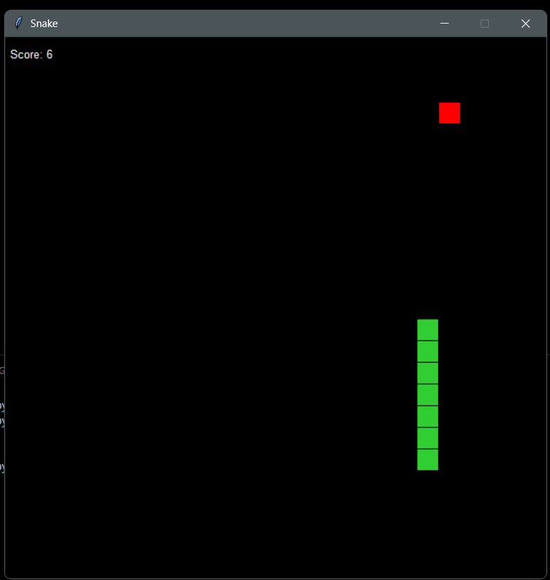

# Python Snake Game

The classic snake game that runs in command line interface, mode by using python.

<div align="center">


Simple Snake Game
</div>

## Basic Instructions

Use the arrow keys to move: the left arrow key to move left, the right arrow key to move right, the up arrow key to move up, and the down arrow key to move down.

## How to play

- Clone the repository:

```
$ git clone https://github.com/prasa-c/snake-game.git
```

- Install Python:

Make sure Python is installed on your system. You can download it from the official [Python website](https://www.python.org/).

- Open the project in Visual Studio Code:

Open Visual Studio Code and click on "File" -> "Open Folder...".
Select the folder where you cloned your repository.

- Run ```snake.py```:

With the Python file open, press ```F5``` or ```Ctrl + F5```. This will execute ```snake.py``` in the integrated terminal.

- Play the game:


